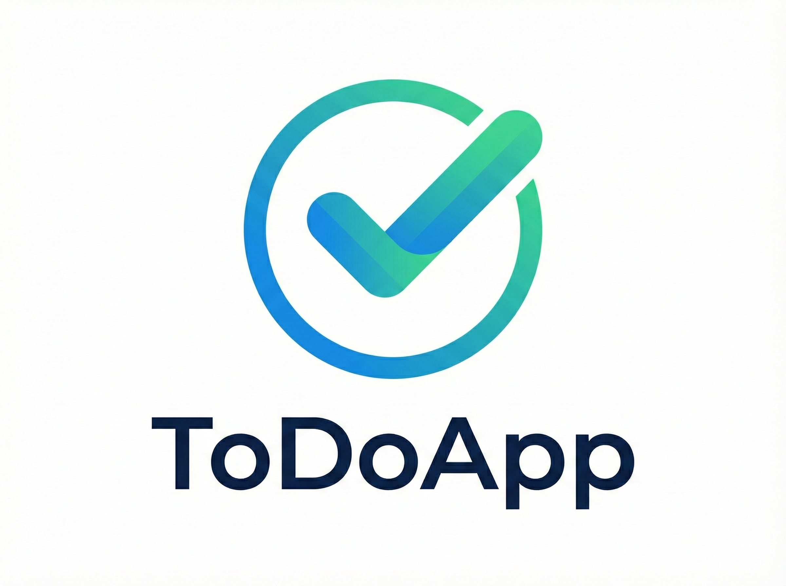
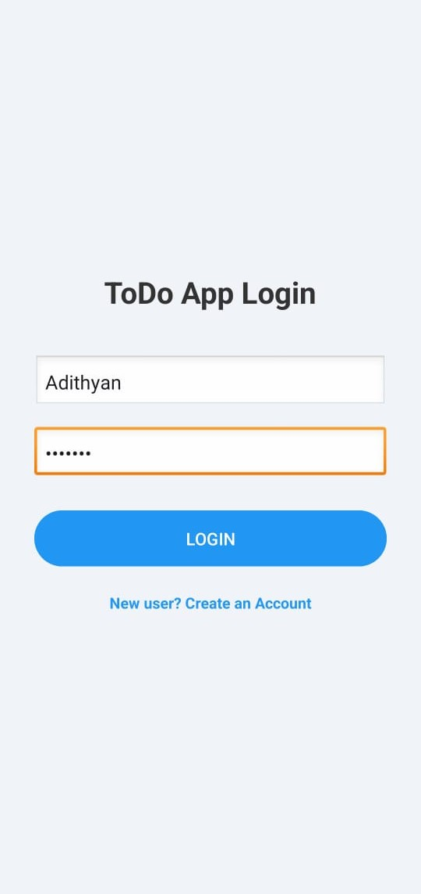
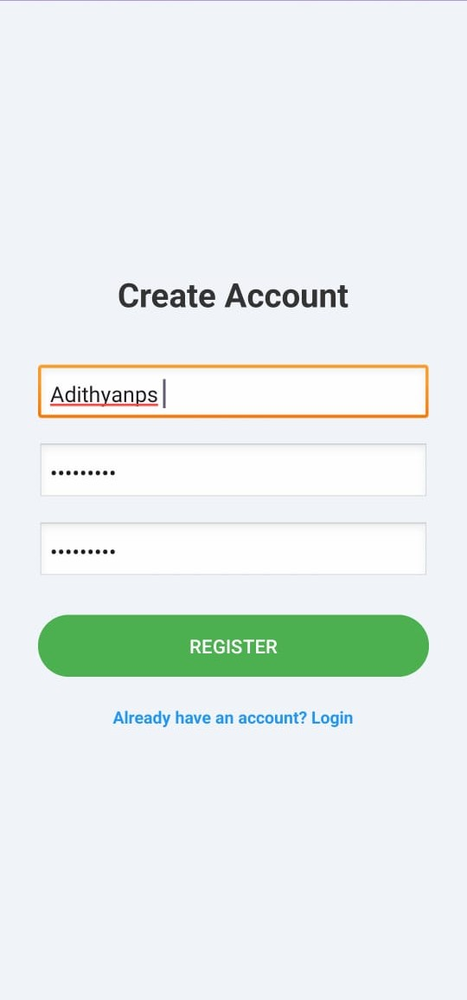
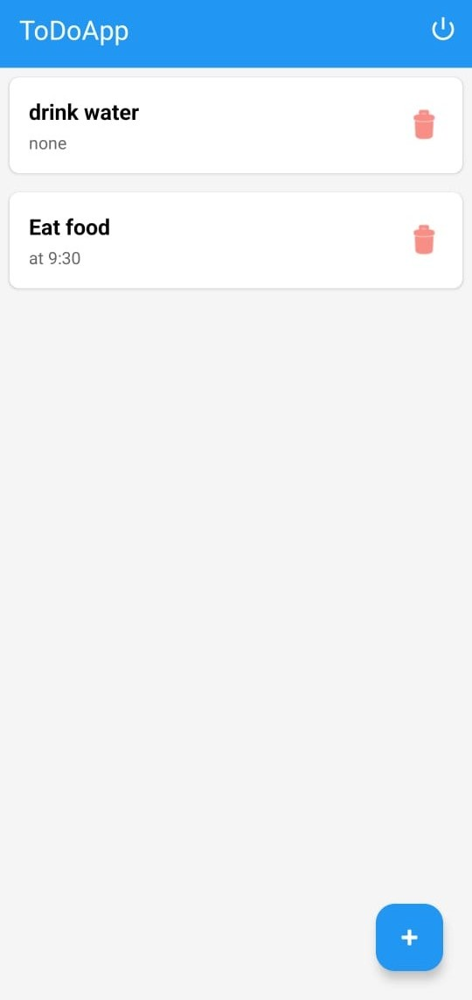

<div align="center">
  

  <h1>To-Do List App</h1>
  <p>
    <b>OIBSIP Task 2</b> - Android Development Internship
  </p>

  <a href="https://github.com/Adithyanps47/oibsip-task2-to-do-app">
    
  </a>
  <a href="https://developer.android.com/">
    
  </a>
  <a href="https://sqlite.org/index.html">
    
  </a>
  <a href="#">
    
  </a>
</div>

<br />

## 📖 About
This Android application was developed as part of the **Oasis Infobyte Android Development Internship** (OIBSIP). It is a robust **To-Do List** application that goes beyond simple lists by integrating secure user authentication and persistent database storage. It allows users to create accounts, log in, and manage their personal tasks securely.

## 🚀 Features
The app includes the following key functionalities:
* **🔐 User Authentication:** Secure Login and Sign-up system to protect user data.
* **💾 Persistent Storage:** Uses **SQLite Database** to store tasks permanently (data remains after closing the app).
* **📝 Task Management:** Add, view, and delete daily tasks instantly.
* **👤 User-Specific Data:** Tasks are linked to specific User IDs, so users only see their own data.

**Additional Highlights:**
* ✅ Password Validation (Minimum length & complexity checks)
* ✅ Custom Dialogs for adding tasks
* ✅ Clean XML UI with "Light Mode" enforcement for consistency

## 📸 Screenshots
| Login Screen | Signup Screen | Task List |
|:---:|:---:|:---:|
|  |  |  |

## 🎥 Demo
See the app in action!

[**▶️ Watch Demo Video**](docs/demo/demo_video.mp4)
<br>
*(Click above to view the screen recording inside the repository)*

> **Note:** You can also view the demonstration on my [LinkedIn Profile](https://www.linkedin.com/in/adithyan-p-s-mobile/).

## 🛠 Tech Stack
* **Language:** Java
* **UI:** XML (CardView, RecyclerView, Relative Layouts)
* **Database:** SQLite (Android Native)
* **IDE:** Android Studio Ladybug
* **Build System:** Gradle

## 📥 How to Run
If you want to build the project from source:

1.  **Clone the repository**
    ```bash
    git clone [https://github.com/Adithyanps47/oibsip-task2-to-do-app.git](https://github.com/Adithyanps47/oibsip-task2-to-do-app.git)
    ```
2.  **Open in Android Studio**
    * Open Android Studio -> File -> Open -> Select the cloned folder.
3.  **Sync Gradle**
    * Wait for the build to finish.
4.  **Run**
    * Press the ▶️ Run button to launch on an Emulator or Physical Device.

## 📱 Download APK
Don't want to build it? Download the latest version directly:
[**⬇️ Download v1.0 APK**](https://github.com/Adithyanps47/oibsip-task2-to-do-app/releases)

---

## 👤 Internship Details
* **Company:** Oasis Infobyte
* **Program:** Android Development Internship
* **Task:** Task 2 (To-Do List App)
* **Intern:** Adithyan P S
* **LinkedIn:** [**Adithyan P S**](https://www.linkedin.com/in/adithyan-p-s-mobile/)

---
<div align="center">
  <i>Made with ❤️ by Adithyan P S</i>
</div>
